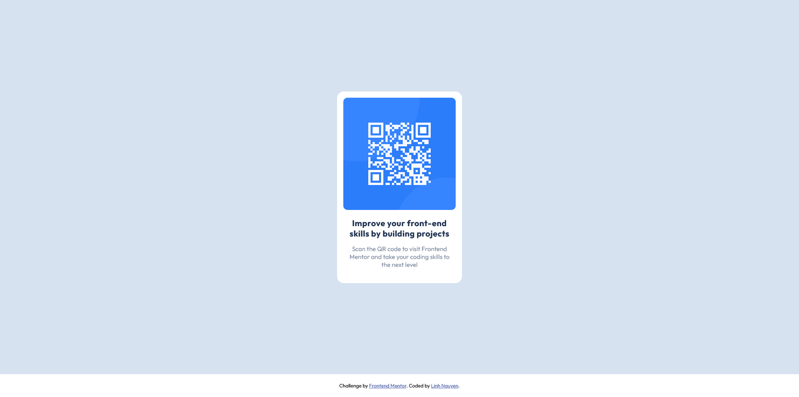

# Frontend Mentor - QR code component solution

## Table of contents

- [Overview](#overview)
  - [Screenshot](#screenshot)
  - [Links](#links)
- [My process](#my-process)
  - [Built with](#built-with)
  - [What I learned](#what-i-learned)
  - [Continued development](#continued-development)
  - [Useful resources](#useful-resources)
- [Author](#author)
- [Acknowledgments](#acknowledgments)

## Overview

### Screenshot

_1. Desktop display_



_2. Mobile display_


### Links

- Live Site URL: [QR code page](https://auri222.github.io/qr-code-HTML-CSS/)

## My process

### Built with

- Semantic HTML5 markup
- CSS custom properties
- Flexbox

### What I learned

- The challenge helps me realize how the arrangement of HTML structure can help me achieve the outcome that I want. To put it clearly, I want the attribution part to act like a footer of the page and still want to use flexbox, so the structure will as below:

```html
<div class="wrapper">
    <div class="container">
      <div class="box">
        <div class="img-container">
          
        </div>
        <h3 class="title">
          Improve your front-end skills by building projects
        </h3>
        <p class="content">
          Scan the QR code to visit Frontend Mentor and take your coding skills to the next level
        </p>
      </div>
    </div>
    <div class="attribution">
      Challenge by <a href="https://www.frontendmentor.io?ref=challenge" target="_blank">Frontend Mentor</a>. 
      Coded by <a href="https://github.com/auri222/qr-code-HTML-CSS">Linh Nguyen</a>.
    </div>
  </div>
```
> The HTML structure is a little bit messy so maybe I will try another approach. What do you think?
- About the CSS part, I learned how to use Flexbox the way I want, calc function, and reusable CSS variables.
```css
:root {
  --secondary-bg-color: hsl(0, 0%, 100%);
  --main-bg-color: hsl(212, 45%, 89%);
  --secondary-text-color: hsl(220, 15%, 55%);
  --main-text-color: hsl(218, 44%, 22%);
  --link-text-color: hsl(228, 45%, 44%);
}

.container {
  width: 100%;
  height: calc(100vh - 55px);
  background-color: var(--main-bg-color);
  display: flex;
  align-items: center;
  justify-content: center;
}
```

### Continued development

Maybe I will try to use CSS grid on this project for another perpective to approach this challenge. 

### Useful resources

- [MDN Web Docs](https://developer.mozilla.org/en-US/) - This website helped me understand some CSS basics such as how to use some functions like var() and calc().
- [Kevin Powell's Youtube channel ](https://www.youtube.com/@KevinPowell) - This is an amazing Youtube channel which helped me understand a lots of CSS concepts. I'd recommend it to anyone want to learn about CSS.

## Author

- Frontend Mentor - [@auri222](https://www.frontendmentor.io/profile/auri222)

## Acknowledgments

- Thank you Frontend Mentor for this challenge that helped me approach a lot of new aspects as a coder. Before this, I didn't know how to write an appropriate markdown file, now I can use this skill for new projects in the future.

